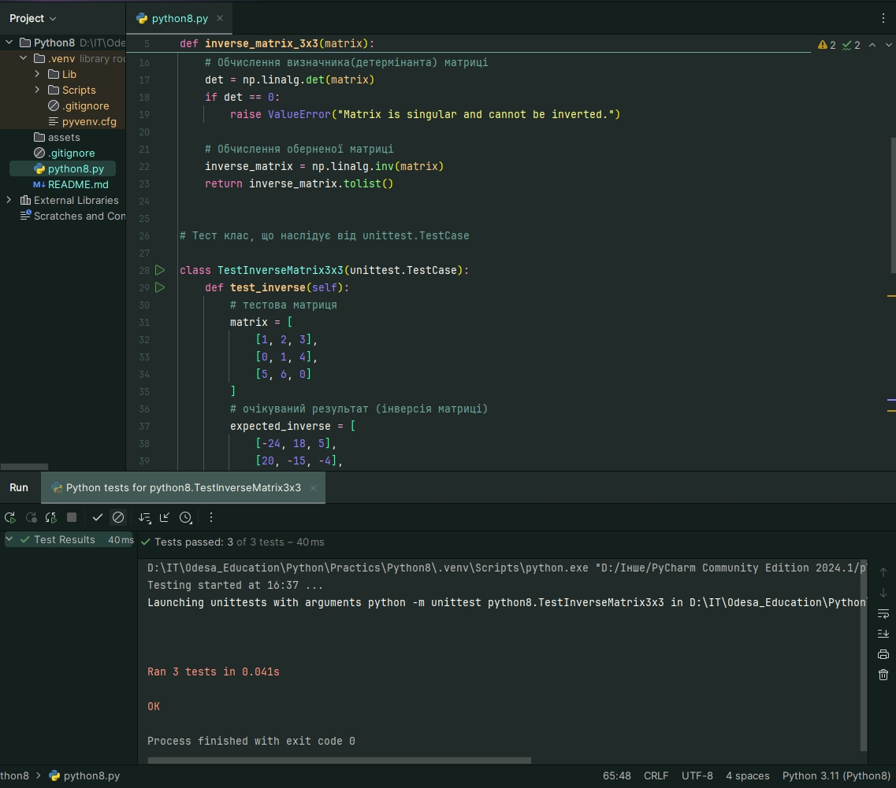

# Практична робота 8.

На цій практичній роботі реалізовано завдання №3.

> **Завдання №3:** "Напишіть функцію для обчислення оберненої матриці 3x3 та unittest для перевірки її коректності."

Результати тестування:

